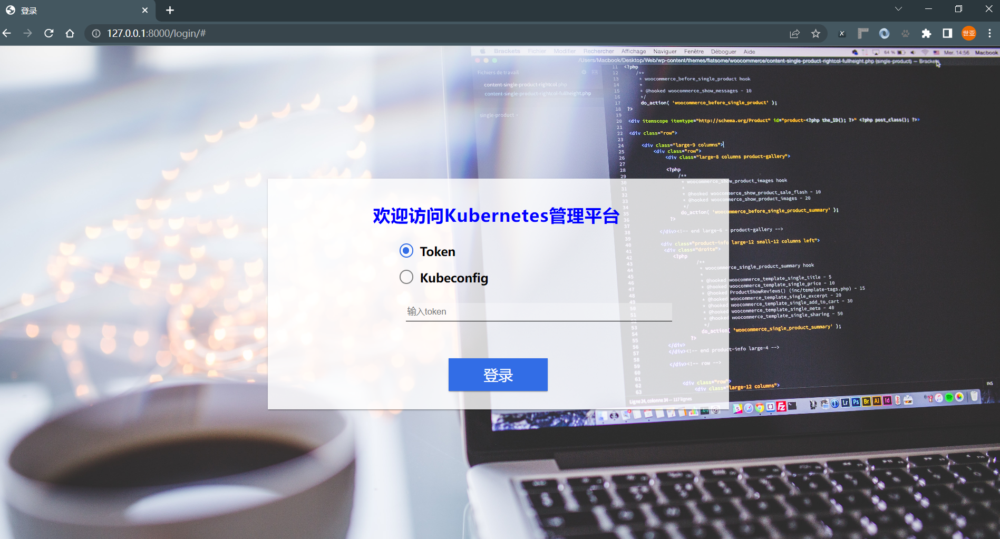
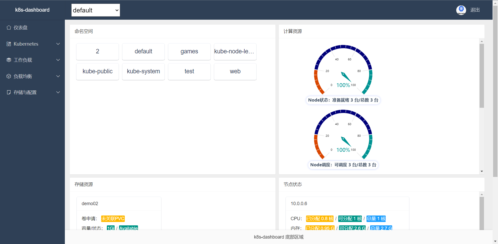
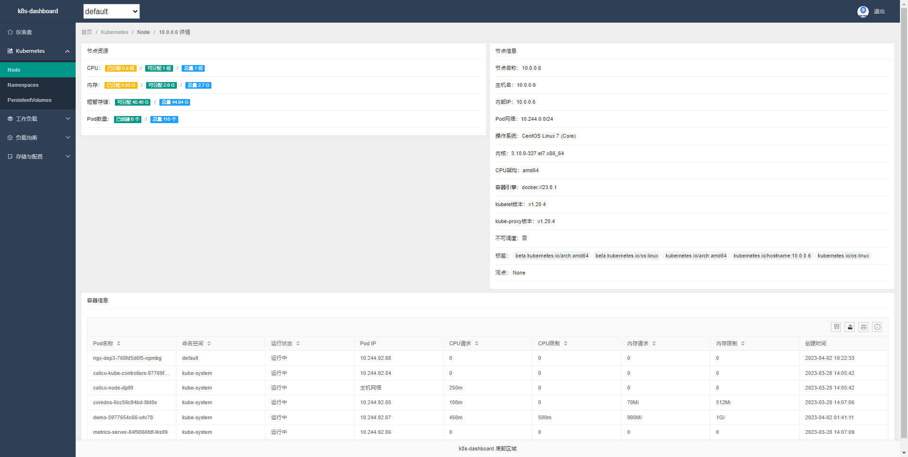
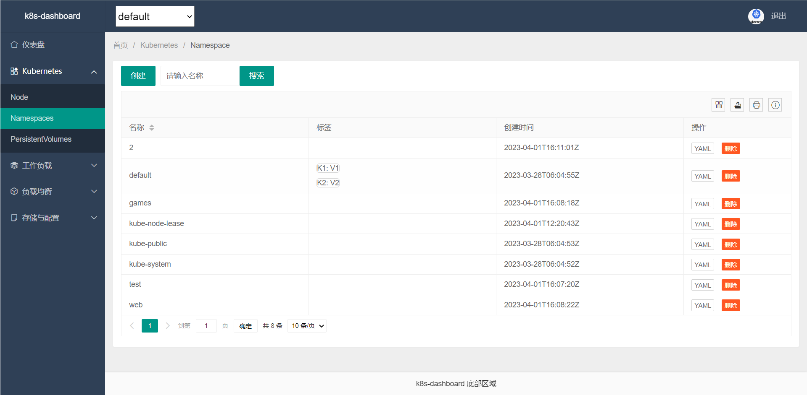
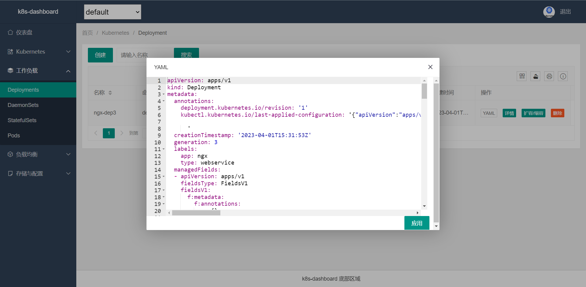
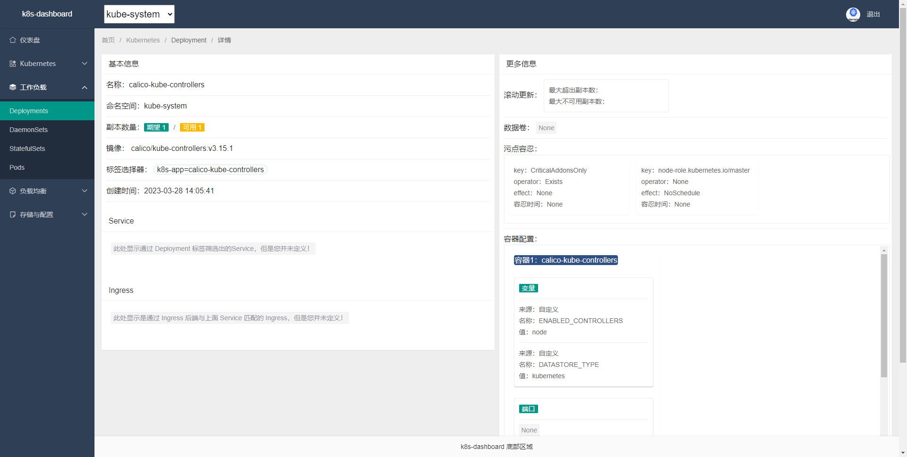

# k8s-dashboard

## 简介
本项目使用[kubernetes](https://pypi.org/project/kubernetes/)结合Django进行开发，参照k8s dashboard认证机制，支持
使用token以及kubeconfig认证登录

涉及功能模块如下：

* 登录
* 权限验证
* 查看资源
* 创建资源
* 删除资源
* 更新yaml
* 查看日志
* 登录容器
* 等......

### 效果展示

登录页

首页仪表盘


node详情页



namespace详情页


deployment查看yaml


deployment详情页



## 知识文档

* [Django](https://github.com/LiuShiYa-github/k8s-dashboard/blob/main/img/Django.md)
* [HTML](https://github.com/LiuShiYa-github/k8s-dashboard/blob/main/img/HTML.md)
* [Layui](https://github.com/LiuShiYa-github/k8s-dashboard/blob/main/img/Layui.md)
* [K8sapi](https://github.com/LiuShiYa-github/k8s-dashboard/blob/main/img/K8s-api.md)


## 持续优化
因时间紧迫，部分功能粗糙，后续需要继续优化：
```text
1、pv等资源创建完成后自动跳转到pv展示页面
2、pv等资源创建支持自定义大小规格
3、创建deployment资源时自动获取所有的名称空间，而不是随着上面页面的名称空间创建
4、健全Django开发文档
```


