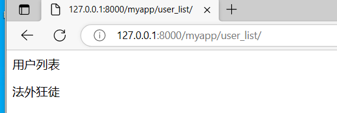
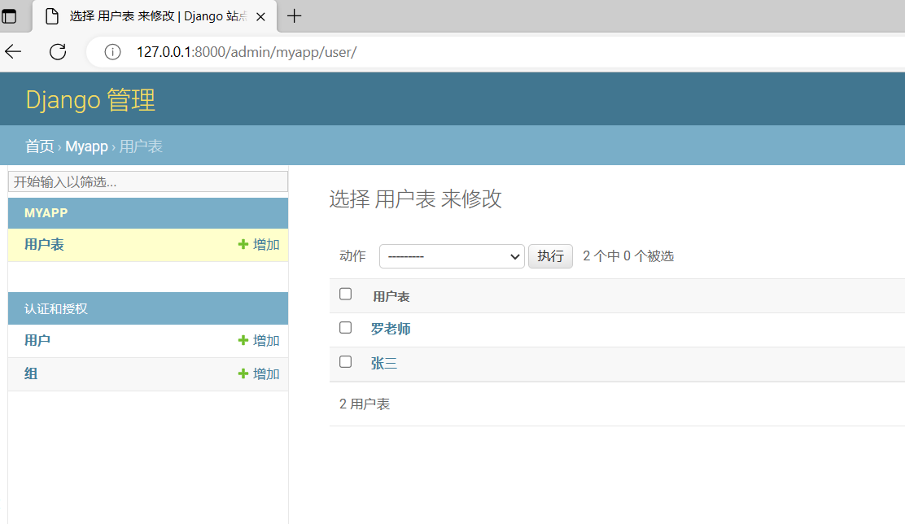
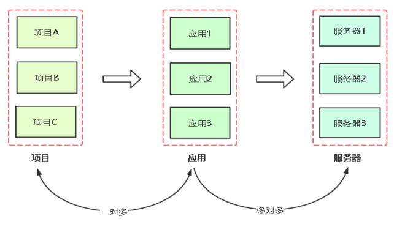
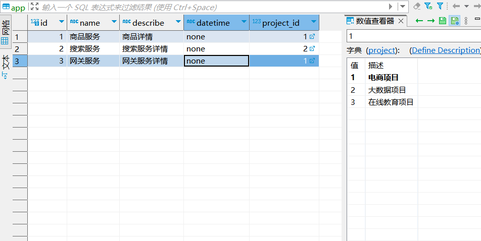
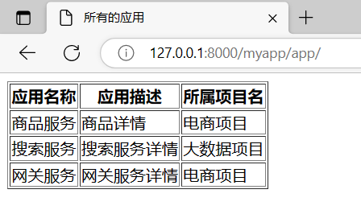
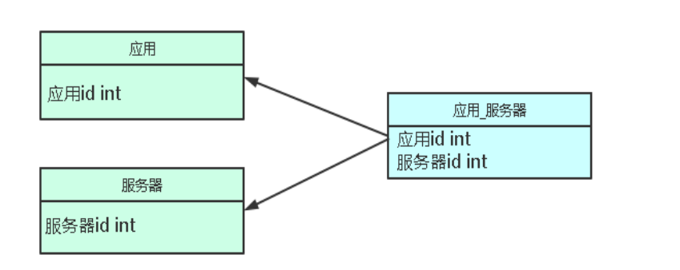
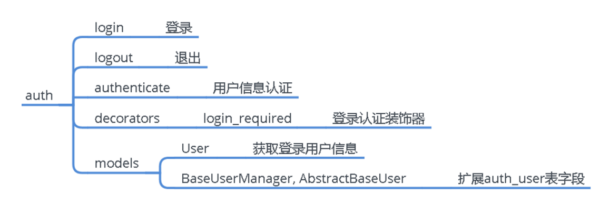
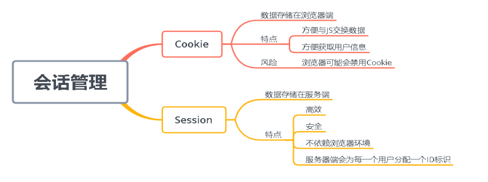

<!-- TOC -->
* [基础知识](#基础知识)
    * [Django基本使用](#Django基本使用)
      * [Django是什么](#Django是什么)
      * [开发环境准备](#开发环境准备)
      * [创建项目](#创建项目)
      * [牛刀小试](#牛刀小试)
      * [牛刀小试第二个页面：网页展示日志文件](#牛刀小试第二个页面：网页展示日志文件)
      * [Django工作流程](#Django工作流程)
    * [Django路由系统](#Django路由系统)
      * [URL路由系统是什么](#URL路由系统是什么)
      * [URL配置](#URL配置)
      * [URL正则表达式](#URL正则表达式)
      * [URL名称](#URL名称)
    * [Django试图](#Django试图)
      * [Django内置函数](#Django内置函数)
      * [HttpRequest对象](#HttpRequest对象)
        * [常用属性](#常用属性)
        * [常用方法](#常用方法)
        * [接收URL参数](#接收URL参数)
        * [QueryDict对象](#QueryDict对象)
        * [示例](#示例)
      * [HttpResponse函数](#HttpResponse函数)
        * [render函数](#render函数)
        * [redirect函数](#redirect函数)
        * [StreamingHttpResponse函数](#StreamingHttpResponse函数)
        * [StreamingHttpResponse函数](#StreamingHttpResponse函数)
        * [FileResponse函数](#FileResponse函数)
        * [JsonResponse函数](#JsonResponse函数)
    * [Django模板系统](#Django模板系统)
      * [模板是什么](#模板是什么)
      * [变量](#变量)
      * [标签](#标签)
      * [常用过滤器](#常用过滤器)
        * [自定义过滤器](#自定义过滤器)
      * [注释](#注释)
      * [模板继承](#模板继承)
      * [模板导入](#模板导入)
      * [引用静态文件](#引用静态文件)
    * [数据模型(ORM)](#数据模型(ORM))
      * [ORM介绍、配置使用数据库](#ORM介绍、配置使用数据库)
        * [ORM是什么](#ORM是什么)
        * [使用ORM](#使用ORM)
        * [使用Mysql数据库](#使用Mysql数据库)
        * [ORM基本增删改查](#ORM基本增删改查)
        * [内置管理后台](#内置管理后台)
        * [模型中的Meta类与方法](#模型中的Meta类与方法)
      * [QuerySet序列化，模型类常用字段](#QuerySet序列化，模型类常用字段)
      * [一对一关系案例](#一对一关系案例)
        * [创建模型关系](#创建模型关系)
        * [增删改查](#增删改查)
      * [一对多关系案例](#一对多关系案例)
        * [创建模型关系](#创建模型关系)
        * [增删改查](#增删改查)
      * [多对多关系案例](#多对多关系案例)
        * [创建模关系](#创建模关系)
        * [增删改查](#增删改查)
      * [Django内置用户认证机制](#Django内置用户认证机制)
        * [内置用户认证系统](#内置用户认证系统)
        * [auth模块使用](#auth模块使用)
    * [DjangoSession管理](#DjangoSession管理)
        * [Session与Cookie是什么](#Session与Cookie是什么)
        * [Django使用Session](#Django使用Session)
    * [DjangoCSRF防护](#DjangoCSRF防护)
        * [CSRF是什么](#CSRF是什么)
        * [DjangoCSRF工作原理](#DjangoCSRF工作原理)
        * [使用CSRF防护机制](#使用CSRF防护机制)
<!-- TOC -->


# 基础知识


### Django基本使用
#### Django是什么
```text
Django是python的一个主流web框架，提供一站式解决方案，开发成本低，内建ORM、数据管理后台、登录认证、表单、RESTAPI等功能，适合中大型项目开发

其他web框架
·flask（轻量级）
·Tornado（异步）

官网：https://www.djangoproject.com
```

#### 开发环境准备

| 软件         | 安装方式                      |
|------------|---------------------------|
| Django3.0  | pip install django==3.0.5 |
| pycharm社区版 | 官方网站下载安装                  |
| pymysql    | pip install pymysql       |
| mysql5.7   | docker-compose.yaml方式安装   |
| python3.8  | 官方网站下载安装                  |

#### 创建项目
```text
1、创建项目
django-admin startprojet youproject .
2、创建应用
python manage.py startapp youapp
3、运行项目
python manage.py runserver 0.0.0.0:8888
```

#### 牛刀小试

```python
# 安装Django
C:\Users\Administrator\PycharmProjects\牛刀小试\venv\Scripts\pip.exe install Django
# 创建项目
PS C:\Users\Administrator\PycharmProjects\牛刀小试> C:\Users\Administrator\PycharmProjects\牛刀小试\venv\Scripts\django-admin.exe startproject app .
# 创建应用
PS C:\Users\Administrator\PycharmProjects\牛刀小试> C:\Users\Administrator\PycharmProjects\牛刀小试\venv\Scripts\python.exe .\manage.py startapp myapp
# 编写urls.py
from django.contrib import admin
from django.urls import path
from myapp import views
urlpatterns = [
    path('admin/', admin.site.urls),
    path('index/', views.index)
]
# 添加试图
from django.shortcuts import render
from django.http import HttpResponse


def index(request):
    return HttpResponse("首页")

# 运行项目
C:\Users\Administrator\PycharmProjects\牛刀小试\venv\Scripts\python.exe .\manage.py runserver 127.0.0.1:80
        
```


#### 牛刀小试第二个页面：网页展示日志文件

```python
# 设置模板路径（settings.py）
TEMPLATES = [
    {
        'BACKEND': 'django.template.backends.django.DjangoTemplates',
        'DIRS': [BASE_DIR/'templates'],

# 添加url路由(app/urls.py)
from django.contrib import admin
from django.urls import path
from myapp import views
urlpatterns = [
    path('admin/', admin.site.urls),
    path('index/', views.index),
    path('logs/', views.logs),
]
# 添加试图（myapp/views.py）
def logs(request):
    import os
    # 获取当前文件路径
    current_dir = os.path.dirname(os.path.abspath(__file__))
    with open(current_dir + "\\access.log") as f:
        result = f.read()
    return render(request, "logs.html", {"result": result})

# 创建HTML模板（项目路径下新建templates目录，该目录下新建logs.html）
<!DOCTYPE html>
<html lang="en">
<head>
    <meta charset="UTF-8">
    <title>日志</title>
</head>
<body>
<h1>Nginx访问日志</h1>
<pre>{{ result }}</pre>
</body>
</html>
# 将access.log放到myapp中
```


优化前端展示

```html
<!DOCTYPE html>
<html lang="en">
<head>
    <meta charset="UTF-8">
    <title>日志</title>
</head>
<body>
<h1>Nginx访问日志</h1>
<div style="background-color: black; color: white">
    <span style="font-size: 15px"><pre>{{ result }}</pre></span>
</div>
</body>
</html>
```


#### Django工作流程


### Django路由系统


#### URL路由系统是什么

```text
简而言之，路由系统就是URL路径和视图函数的一个对应关系，也可以称为转发器。
```


#### URL配置

```python
urlpatterns = [
    path('admin/', admin.site.urls),
    path('index/', views.index),
    path('logs/', views.logs),
]
```

参数解释

```text
urlpatterns：一个列表，每一个path()函数是一个元素，对应一个视图
参数：
	• regex：一个字符串或者正则表达式，匹配URL
	• view：对应一个函数视图或者类视图（as_view()的结果），必须返回一个HttpResponse对象，Django将这个对象转换成一个HTTP响应
	• kwargs：可选，字典形式数据传递给对应视图
	• name：可选，URL名称
```

示例

```python
# 创建urls.py(在myapp目录下创建)
from django.urls import path
from myapp import views
urlpatterns = [
    path('hello/', views.hello),
    path('logs/', views.logs),
]

# 创建hello函数（myapp/views.py）
def hello(request):
    return HttpResponse("Hello Django")

# 项目路径下urls.py
from django.contrib import admin
from django.urls import path, include
from myapp import views
urlpatterns = [
    path('admin/', admin.site.urls),
    path('index/', views.index),
    path('logs/', views.logs),
    path('myapp/', include('myapp.urls')),
]
# 访问 http://127.0.0.1/myapp/hello/
```


#### URL正则表达式

URL路径也可以使用正则表达式匹配，re_path()替代path()

示例：博客文章归档访问形式

```python
# urls.py
from django.urls import re_path
from devops import views
urlpatterns = [
    re_path('articles/2023/$', views.specified_2023),
    re_path('^articles/([0-9]{4})/$', views.year_archive),
    re_path('^articles/([0-9]{4})/([0-9]{2})/$', views.month_archive),
    re_path('^articles/([0-9]{4})/([0-9]{2})/([0-9]+)/$', views.article_detail),
]
# views.py
def specified_2023(request):
	return HttpResponse("指定2023年 文章列表")
def year_archive(request, year):
	return HttpResponse("%s年 文章列表" % year)
def month_archive(request, year, month):
	return HttpResponse("%s年/%s月 文章列表" % (year, month))
def article_detail(request, year, month, id):
	return HttpResponse("%s年/%s月 文章ID: %s" %(year, month, id))

```


#### URL名称

```html
之前
<a href="/hello">你好</a>
之后
<a href="">你好</a>
```


### Django试图

#### Django内置函数


#### HttpRequest对象

##### 常用属性

Django会建立一个包含请求源数据的HttpRequest对象，当Django加载对应的视图时，HttpRequest 对象将作为函数视图的第一个参数（request），每个视图负责返回一个HttpResponse对象。

例如：

```python
def index(request):
    return HttpResponse("首页")
```


| 属性            | 描述                                                    |
| --------------- | ------------------------------------------------------- |
| request.scheme  | 表示请求协议的字符串（http或https）                     |
| request.body    | 原始HTTP请求正文                                        |
| request.path    | 一个字符串，请求页面的完整路径，不包含域名              |
| request.method  | 一个字符串，请求的HTTP方法，比如GET/POST等              |
| request.GET     | GET请求所有参数，返回QueryDict类型，类似于字典          |
| request.POST    | POST请求所有参数，返回QueryDict类型                     |
| request.COOKIES | 以字典格式返回Cookie                                    |
| request.session | 可读写的类似于字典的对象，表示当前的会话                |
| request.FILES   | 所有上传的文件                                          |
| request.META    | 返回字典，包含所有的HTTP请求头。比如客户端IP，Referer等 |

##### 常用方法

| 方法                    | 描述                                        |
| ----------------------- | ------------------------------------------- |
| request.get_host()      | 服务器主机地址和端口                        |
| request.get_port()      | 服务器端口                                  |
| request.get_full_path() | 请求页面完整路径和查询参数                  |
| request.get_raw_uri()   | 请求页面URL所有信息，包括主机名、路径和参数 |

##### 接收URL参数

URL参数形式：http://www.xxx.cn/demo/?id=1&value=100

```python
def url_args(request):
    args1 = request.GET['a']
    args2 = request.GET['b']
return HttpResponse(int(args1) + int(args2))
```

##### QueryDict对象

request.GET和request.POST返回的都是一个QueryDict对象，类似于字典。

```python
def index(request):
    req = request.GET
    print(type(req))
return HttpResponse("首页")
```

| 方法                     | 描述                                          |
| ------------------------ | --------------------------------------------- |
| req.get(key,default)     | 返回key的值，如果key不存在返回default         |
| req.items()              | 返回迭代器，键值                              |
| req.values()             | 返回迭代器，所有键的值                        |
| req.keys()               | 返回所有键                                    |
| req.getlist(key,deafult) | 返回key的值作为列表，如果key不存在返回default |
| req.lists()              | 返回迭代器，所有键的值作为列表                |
| req.dict()               | 返回字典                                      |

##### 示例

一：表单GET提交搜索页面

二：表单POST提交登录页面

三：上传文件，例如修改头像


#### HttpResponse函数

HttpResponse函数：给浏览器返回数据。 

语法：HTTPResponse(content=响应体，content_type=响应体数据类型，status=状态码)

示例：返回HTML内容

```python
from django.http import HttpResponse
def hello(request):
    return HttpResponse("<h1>Hello Django!</h1>")
```

示例：设置响应头

```python
from django.http import HttpResponse
def hello(request):
	res = HttpResponse("Hello APP!")
    res['name'] = '测试'
    res.status_code = 302
```


##### render函数

render指定模板，返回一个渲染后的HttpResponse对象。 

语法：render(request, template_name, context=None, content_type=None, status=None, using=None)

- request：固定参数，django封装的请求
-  template_name：返回html模板 
-  context：传入模板中的内容，用于渲染模板，默认空字典

示例：

```python
from django.shortcuts import render
from datetime import datetime
def current_datetime(request):
    now = datetime.now()
    return render(request, 'demo.html', {'datetime': now})
```


##### redirect函数

redirect函数：重定向，发起第二次请求 语法：redirect(to, *args, **kwargs)

参数可以是： 

- 一个视图 
- 一个绝对的或者相对的URL 
- 一个模型，对象是重定向的URL

示例：

```python
from django.shortcuts import redirect
def test_redirect(request):
    return redirect('https://www.baidu.com')
```

##### StreamingHttpResponse函数

StreamingHttpResponse函数：流式响应可迭代对象

##### StreamingHttpResponse函数

示例：下载文件 

URL路由

```python
re_path('^download/$', views.download),
re_path(r'^down_file/(?P<filename>.*)$', views.down_file, name="down_file")
```

视图

```python
from django.http import StreamingHttpResponse
import os
def download(request):
    file_list = os.listdir('upload')
	return render(request, "download.html", {'file_list': file_list})

def down_file(request, filename):
    file_path = os.path.join('upload', filename)
    response = StreamingHttpResponse(open(file_path, 'rb'))
    response['Content-Type'] = 'application/octet-stream'
    response['Content-Disposition'] = 'attachment; filename=%s'
    %(os.path.basename(file_path))
	return response
```

模板

```html
<!DOCTYPE html>
<html lang="en">
<head>
    <meta charset="UTF-8">
    <title>文件列表</title>
</head>
<body>
    
    <p><a href="">{{ i }}</a></p>
    
</body>
</html>
```

##### FileResponse函数

FileResponse函数：如果提供文件下载建议方法

示例：下载文件

```python
def down_file(request, filename):
    file_path = os.path.join('upload', filename)
    response = FileResponse(open(file_path, 'rb'))
    response['Content-Type'] = 'application/octet-stream'
    response['Content-Disposition'] = 'attachment; filename=%s'
    %(os.path.basename(file_path))
	return response
```

##### JsonResponse函数

JsonResponse函数：响应一个JSON对象

示例：下载文件

```python
from django.http import JsonResponse
def test_response(request):
    res = {‘foo’: ‘bar’}
	return JsonResponse(res)
```


### Django模板系统

#### 模板是什么

Django模板系统：用于自动渲染一个文本文件，一般用于HTML页面。模板引擎渲 染的最终HTML内容返回给客户端浏览器。

 模板文件有两部分组成：

-  静态部分，例如html、css、js 
-  动态部分，django模板语言，类似于jinja语法

#### 变量

变量定义：在函数视图render中的context传入，类似于字典对象。 

变量在模板中引用，格式：{{ key }} 

示例：

```python
def hello(request):
    user = {'name': '张三', 'property': {'sex': '男', 'age': 30}}
	return render(request, 'user.html', {'user': user})
```

```html
<!DOCTYPE html>
<html lang="en">
<head>
    <meta charset="UTF-8">
    <title>用户信息</title>
</head>
<body>
传递过来的字典: {{ user }}<br>
姓名: {{ user.name }}<br>
性别: {{ user.property.sex }}<br>
年龄: {{ user.property.age }}<br>
</body>
</html>

```

**设置全局变量**

1、在项目目下创建contexts.py文件

```python
def user(request):
    username = request.session.get('username')
    return {'username': username}
```


2、在settings.py文件中添加你的上下文处理器

3、```<h3>欢迎：{{ username }}</h3>```


#### 标签

**if条件判断**f

判定给定的条件是否满足（True或False），根据判断的结果决定执行的语句。 

语法： 

```html

    <内容块> 
 
    <内容块> 
 
    <内容块> 

```
f
**操作符号**

| 类型       | 操作符                                              |
| ---------- | --------------------------------------------------- |
| 比较操作符 | == 等于; !=不等于;>大于;<小于;>=大于等于;<=小于等于 |
| 逻辑操作符 | and 与; or 或                                       |
| 成员操作符 | not 逻辑否定; in 包含在内                           |

**循环**

for循环：一般用于遍历数据类型的元素进行处理，例如列表。

 语法： 

```html
 
    <内容块> 

```

**forloop变量**

forloop是在标签中生成的变量，用于获取当前循环进展信息.

| 变量                | 描述                                        |
| ------------------- | ------------------------------------------- |
| forloop.counter     | 循环计数器，当前循环的索引从1开始           |
| forloop.counter0    | 循环计数器，当前循环的索引从0开始           |
| forloop.revcounter  | 当前循环倒数计数，最后一次循环为1，反向计数 |
| forloop.revcounter0 | 当前循环倒数计数，最后一次循环为0，反向计数 |
| forloop.first       | 当前循环为第一个循环时，该变量为True        |
| forloop.last        | 当前循环为最后一个循环时，该变量为True      |
| forloop.parentloop  | 再嵌套循环中，指向当前循环的上级循环        |

**for empty**

for...empty 当循环的序列为空时，执行empty下面的内容。

 语法： 

```html
 
    <遍历> 
 
    <代码块> 

```


#### 常用过滤器

过滤器：在变量被显示前修改值的一种方法。

语法：{{ value | 过滤器:参数 }}

| 过滤器         | 说明                                                         | 示例                                                         |
| -------------- | ------------------------------------------------------------ | ------------------------------------------------------------ |
| add            | 将两个值转换为整数相加                                       | {{ 11 \| add:"6" }} 结果 17                                  |
| cut            | 切除字符。从给定字符串中删除arg的所有值。                    | {{ "hello world" \| cut:"w" }} 结果 hello orld               |
| default        | 如果值的计算结果为 False，则使用给定的默认值。否则，使用该值。 | {{ "" \| default:"hello world" }} 结果 hello world           |
| first          | 返回第一个元素                                               | {{ "hello world" \| first }} 结果 h                          |
| last           | 返回最后一个元素                                             | {{ "hello world" \| last }} 结果 d                           |
| join           | 使用字符串连接列表，如Python的 str.join(list)                | {{ abc \| join:"," }} 结果 1,2,3 # abc = [1,2,3]             |
| length         | 返回值的长度。这适用于字符串和列表                           | {{ "hello world" \| length }} 结果 11                        |
| lower          | 将字 符串转换为小写                                          | {{ "AAA" \| lower }} 结果 aaa                                |
| upper          | 将字符串转换为大写                                           | {{ "aaa" \| upper }} 结果 AAA                                |
| slice          | 切片, 类似于Python中的切片操作                               | {{ "hello world" \| slice:"2:" }} 结果 llo world             |
| title          | 所有单词首字母大写                                           | {{ "aaa" \| title }} 结果 Aaa                                |
| truncatechars  | 如果长度大于指定的字符数，则截断字符串。截断的字符串将以可 翻译的省略号序列（“...”）结束 | {{ "hello world" \| truncatechars:2 }} 结果 h…               |
| filesizeformat | 将该值格式化为“人类可读”文件大小（即 ‘13 KB‘， ‘4.1 MB‘，‘102 bytes‘ 等）。 | {{ 10000 \| filesizeformat }} 结果 9.8 KB                    |
| floatformat    | 当不带参数时，将一个浮点数舍入到小数点后一位，但前提是要显 示一个小数部分。 | {{ 1.33333333 \| floatformat }} 结果 1.3 floatformat:2 指定保留的小数位数 |


##### 自定义过滤器

1、在app下创建templatetags目录，并且该app必须在 INSTALLED_APPS中进行安装

2、自定义过滤器函数

```python
from django.template import Library
    register = Library() # 注册过滤器对象
    @register.filter # 通过装饰注册自定义过滤器
    def func(n):
    return n / 2
```

3、在模板中使用

```html
 # 开头
{{ 123 | func }} 
```


#### 注释

注释：

{# 注释内容 #}

#### 模板继承

模板继承主要是为了提高代码重用，减轻开发人员的工作量。 

典型应用：网站的头部、尾部信息。 

1、定义一个基础模板，也称为母板，这个页面存放整个网站共用的内容 templates/base.html 

2、在子模板继承这个母版  

3、在基础模板预留子模板差异化内容  预留区域 

 4、在子模板里同样语法引用并填充预留区域内容

#### 模板导入

模板导入：导入一个模板（一般是某个网页功能）到当前模板

将一个功能创建为模板：

```html
# templates/hello.html
<style>
    .hello {
    background-color: red;
    }
</style>
<div class="hello">
    子模板
</div>

```

模板导入：

```html

首页

	<h1>这是首页！</h1>
	

```


#### 引用静态文件

- STATICFILES_DIRS：告诉Django哪个目录是“静态文件的文件夹”
-  STATIC_ROOT：指出浏览器访问静态文件“根路径”

1、在settings.py配置

```python
BASE_DIR = os.path.dirname(os.path.dirname(os.path.abspath(__file__)))
STATICFILES_DIRS = (
os.path.join(BASE_DIR, 'static'),
)
STATIC_URL = '/static/'
```

2、在模板文件引用静态文件

```html
<link rel="stylesheet" href="/static/main.css">
或者
 # 在模板文件开头
<link rel="stylesheet" href="">
```
### 数据模型(ORM)

#### ORM介绍、配置使用数据库
##### ORM是什么
```text
对象关系映射（Object Relational Mapping，ORM）：是一种程序设计技术，用于实现面向对象编程语言里不同类型系统的数据之间的转换。
简单来说就是在编程语言中实现的一种虚拟对象数据库。我们对虚拟对象数据库进行操作，它会转成具体的SQL去操作数据库，这样一来我们就不需要学习复杂的sql语句了。

视图函数---> python代码 ---> ORM ---> 转换为SQL ---> Mysql等数据库
```
##### 使用ORM
```text
1、使用模型类定义一个User表，包含多字段
# myapp/models.py
from django.db import models


class User(models.Model):
    user = models.CharField(max_length=30)
    name = models.CharField(max_length=30)
    sex = models.CharField(max_length=30)
    age = models.IntegerField()
    label = models.CharField(max_length=30)


2、在settings.py配置文件中INSTALLED_APPS列表添加APP名称
INSTALLED_APPS = [
    'django.contrib.admin',
    'django.contrib.auth',
    'django.contrib.contenttypes',
    'django.contrib.sessions',
    'django.contrib.messages',
    'django.contrib.staticfiles',
    'myapp',
]
3、将模型类生成具体的数据库表
# 生成迁移文件
python manage.py makemigrations
# 执行迁移文件生成表
python manage.py migrate
4、进入数据库进行查看表
生成表名的默认格式：应用名_模型类名小写
```

##### 使用Mysql数据库
```text
1、启动一个MySQL数据库
# docker-compose.yaml
version: '3'
services:
  mysql:
    image: 'mysql/mysql-server:5.7'
    restart: always
    container_name: mysql
    environment:
      MYSQL_ROOT_PASSWORD: 123456
    command:
      --default-authentication-plugin=mysql_native_password
      --character-set-server=utf8mb4
      --collation-server=utf8mb4_general_ci
      --explicit_defaults_for_timestamp=true
      --lower_case_table_names=1
      --max_allowed_packet=128M;
    ports:
      - 3306:3306
执行授权
docker exec mysql mysql -uroot -p123456 -e "GRANT ALL PRIVILEGES ON *.* TO 'root'@'%' IDENTIFIED BY '123456' WITH GRANT OPTION; flush privileges; flush privileges;"
docker exec mysql mysql -uroot -p123456 -e "create database test;"

2、使用pip工具安装pymysql模块
pip install pymysql
3、修改django默认连接数据库
# settings.py
DATABASES = {
    'default': {
        'ENGINE': 'django.db.backends.mysql',
        'NAME': 'test',
        'USER': 'root',
        'PASSWORD': '123456',
        'HOST': '10.0.0.5',
        'PORT': '3306',
    }
}
4、指定数据库驱动
# myapp/__init__.py
import pymysql
pymysql.install_as_MySQLdb()
5、执行迁移文件生成表
python manage.py migrate
```

##### ORM基本增删改查
```text
# 增
from myapp.models import User


def orm_user_add(request):
    User.objects.create(
        user='张三',
        name='法外狂徒',
        sex='男',
        age='30',
        label='游走在法律边缘'
    )
    return HttpResponse('用户添加成功！')

# 查
def user_list(request):
    user_list = User.objects.all()
    for user in user_list:
        print(user.name)
    return render(request, "user.html", {'user_list': user_list})

# templates/user.html
用户列表

<p>{{ user.name }}</p>

```


```text
# 获取所有数据
User.objects.all()
# 加条件获取数据
User.objects.filter(user='zhangsan')
# 获取单条数据
User.objects.get(id=2)

# 改
User.objects.filter(user='zhangsan').update(age=27,label='奥里给')
或者
obj = User.objects.get(user='zhangsan')
obj.age = 27
obj.save()

# 删
User.objects.filter(id=3).delete()
或者
obj=User.objects.get(id=3)
obj.delete()
```

##### 内置管理后台
```text
1、访问URL
http://127.0.0.1:8000/admin/login/?next=/admin/

2、创建管理员账户
python manager.py createsuperuser

3、注册模型
# myapp/admin.py
from django.contrib import admin
from myapp import models
admin.site.register(models.User)

4、设置语言和时区
# settings.py
LANGUAGE_CODE = 'zh-hans'
TIME_ZONE = 'Asia/Shanghai'
USE_I18N = True
USE_L10N = True
USE_TZ = True
```



##### 模型中的Meta类与方法
Django模型类的Meta是一个内部类，它用于定义一些Django模型类的行为特性
以下是该常用属性：

| 元选项                 | 描述                                                                             |
|---------------------|--------------------------------------------------------------------------------|
| app_label           | 指定APP名称，当模型类不在默认的APP的models.py文件中，这时需要指定模型类是属于哪个APP                            |
| db_table            | 指定生成的数据库表名，默认是"应用名_模型名"                                                        |
| ordering            | 对象的默认顺序，值是一个列表或元素。元素是一个字符串表示字段名，元素前面带减号表示倒序没有表示升序，问号表达随机排序，例如ordering=【"-sex"】 |
| verbose_name        | 定义一个易读的模型名称，默认会加一个复数s                                                          |
| verbose_name_plural | 定义一个易读的模型名称，不带复数s                                                              |


```text
# myapp/models.py
class User(models.Model):
    user = models.CharField(max_length=30)
    name = models.CharField(max_length=30)
    sex = models.CharField(max_length=30)
    age = models.IntegerField()
    label = models.CharField(max_length=30)

    class Meta:
        app_label = "myapp"
        db_table = "myapp_user"
        verbose_name = "用户表"
        verbose_name_plural = "用户表"

    def __str__(self):
        return self.user
```

**模型类常用字段**

| 字段类型                                                     | 描述                                                         |
| ------------------------------------------------------------ | ------------------------------------------------------------ |
| AutoField(**options)                                         | ID自动递增，会自动添加到模型中                               |
| BooleanField(**options)                                      | 布尔值字段（true/false），默认值是None                       |
| CharField(max_length=None[,**options])                       | 存储各种长度的字符串                                         |
| EmailField([max_length=254,**options])                       | 邮件地址，会检查是否合法                                     |
| FileField([upload_to=None,max_length=100,**options])         | 保存上传文件。upload_to是保存本地的目录路径                  |
| FloatField([**options]                                       | 浮点数                                                       |
| GenericIPAddressField(protocol=’both’, unpack_ipv4=False, **options) | IP地址                                                       |
| TextField([**options])                                       | 大文本字符串                                                 |
| URLField([max_length=200,**options])                         | 字符串类型的URL                                              |
| DateTimeField([auto_now=False,auto_now_add=False,**options]) | 日期和时间   1、auto_now=True时，第二次保存对象时自动设置为当前时间。用于 最后一次修改的时间戳，比如更新。 2、auto_now_add=True时，第一次创建时自动设置当前时间。用于创 建时间的时间戳，比如新增。 这两个参数互斥，不能写到一个字段里，分开定义字段用。 |
| DateField([auto_now=False,auto_now_add=False,**options])     | 日期                                                         |
| TimeField([auto_now=False,auto_now_add=False,**options])     | 时间                                                         |


**模型类常用字段选项**


| 选项         | 描述                                      |
| ------------ | ----------------------------------------- |
| null         | 如果为True，字段用NULL当做空值，默认False |
| blank        | 如果为True，允许为空，默认False           |
| db_index     | 如果为True，为此字段建立索引              |
| default      | 字段的默认值                              |
| primary_key  | 如果为True，设置为主键                    |
| unique       | 如果为True，保持这个字段的值唯一          |
| verbose_name | 易读的名称，管理后台会以这个名称显示      |


#### QuerySet序列化，模型类常用字段
序列化：将Python对象转为传输的数据格式

反序列化：将传输的数据格式转为Python对象

ORM查询返回的是QuerySet对象，如果你要提供数据接口，这显然是不行的。

有两种方法可以转为JSON字符串：
· 使用内建函数 serializers
· 遍历QuerySet对象将字段拼接成字典，再通过json库编码
```text
from django.core import serializers
obj = User.objects.all()
data = serializers.serialize('json', obj)
```

```text
import json
obj = User.objects.all()
d = {}
for i in user_list:
    d['name'] = i.name
    d['user'] = i.user
    d['label'] = i.label
data = json.dumps(d)
```

#### 一对一关系案例

```text
常见的数据模型关系有：
• 一对一(one-to-one)，OneToOneField
• 一对多，多对一(one-to-many)，ForeignKey
• 多对多（many-to-many），ManyToManyField
```

**一对一**
```text
一对一：一个表中的每条记录对应另一个表中的每条记录，使用OneToOneField建立关系。
例如：一个人对应一个身份证号，一个身份证号也对应一个人
应用场景：当一个表想扩展字段，最常用的方式就是在这个表添加一个对一关系
```
##### 创建模型关系

**示例：定义一对一模型关系**
```text
class User(models.Model):
    user = models.CharField(max_length=30, verbose_name="用户名")
    name = models.CharField(max_length=30, verbose_name="姓名")
    sex = models.CharField(max_length=30, verbose_name="性别")
    age = models.IntegerField(verbose_name="年龄")
    label = models.CharField(max_length=100, verbose_name="标签")
class IdCard(models.Model):
    number = models.CharField(max_length=20, verbose_name="卡号")
    address = models.CharField(max_length=50, default="北京")
    user = models.OneToOneField(User, on_delete=models.CASCADE) # 定义一对一的模型关系,on_delete=models.CASCADE 表示级联删除
```

##### 增删改查
```text
# 增：
方式1： 
user_obj = User.objects.create(user='alan',name='阿兰',sex='女',age='25',label="运营,漂亮,喜欢购物")
IdCard.objects.create(user=user_obj, number="456789", address="北京")
方式2：
user = User()
user.user='xiaoming'
user.name = "阿兰"
user.sex = '女'
user.age = 25
user.label = "运营,漂亮,喜欢购物"
user.save()

向已有用户添加身份证信息:
user_obj = User.objects.get(user="aliang")
IdCard.objects.create(user=user_obj,
number="123456789", address="北京")

# 查:

反向查询：通过用户查到身份证信息（user->idcard）
user = User.objects.get(user="aliang")
print(user.idcard.number)
print(user.idcard.address)
 
正向查询：从身份证表查用户（idcard->user）
idcard = IdCard.objects.get(user_id=1)
print(idcard.user.user)
print(idcard.user.name)

# 改：
user_obj = User.objects.get(user="aliang")
# 修改身份证信息
user_obj.idcard.address="河南"
user_obj.idcard.save()
# 修改用户信息
user_obj.age = 38
user_obj.save()

# 删：
User.objects.filter(user="alan").delete()
```
#### 一对多关系案例

**一对多**

```text
一对一是表与表之间的关系，而一对多、多对多是表与表中数据的关系

一对多：A表中的某个记录对应B表中的多条记录，使用ForeignKey建立关系。

例如：项目部署涉及表
一对多：一个项目有多个应用，一个应用只能属于一个项目
多对多：一个应用部署到多台服务器，一个服务器部署多个应用
```


##### 创建模型关系

```text
# myapp/models.py
class Project(models.Model):
    name = models.CharField(max_length=30)
    describe = models.CharField(max_length=100, null=True)
    datetime = models.DateTimeField(auto_now_add=True)

    def __str__(self):
        return self.name

    class Meta:
        db_table = 'project'
        verbose_name_plural = '项目'


class App(models.Model):
    name = models.CharField(max_length=30)
    describe = models.CharField(max_length=100, null=True)
    datetime = models.DateTimeField(auto_now_add=True)
    project = models.ForeignKey(Project, on_delete=models.CASCADE)  # 定义一对多的模型关系

    def __str__(self):
        return self.name

    class Meta:
        db_table = 'app'
        verbose_name_plural = '应用'


class Server(models.Model):
    hostname = models.CharField(max_length=30)
    ip = models.GenericIPAddressField()
    describe = models.CharField(max_length=100, null=True)

    def __str__(self):
        return self.hostname

    class Meta:
        db_table = 'server'
        verbose_name_plural = '服务器'

# myapp/urls.py
from django.urls import path
from myapp import views
urlpatterns = [
    path('hello/', views.hello),
    path('logs/', views.logs),
    path('orm/', views.orm_user_add),
    path('user_list/', views.user_list),
    path('app/', views.app),
]
    

# myapp/views.py
def app(request):
    app_list = App.objects.all()
    return render(request, "app.html", {'app_list': app_list})

# templates/app.html
<!DOCTYPE html>
<html lang="en">
<head>
    <meta charset="UTF-8">
    <title>所有的应用</title>
</head>
<body>
<table border="1">
  <thead>
  <tr>
    <th>应用名称</th>
    <th>应用描述</th>
    <th>所属项目名</th>
  </tr>
  </thead>

  <tbody>
  
  <tr>
    <td>{{ app.name }}</td>
    <td>{{ app.describe }}</td>
    <td>{{ app.project.name }}</td>
  </tr>
  
  </tbody>
</table>
</body>
</html>
```



##### 增删改查
```text
# 向项目表添加知的项目名称：
Project.objects.create(name="电商项目",describe="电商项目描述...")
Project.objects.create(name="在线教育项目",describe="在线教育项目描述...")
Project.objects.create(name="大数据项目",describe="大数据项目描述...")

# 创建新应用并加入到项目中
project_obj = Project.objects.get(name="电商项目")
App.objects.create(name="product",describe="商品服务",project=project_obj)
注：操作模型类记得先导入 from myapp.models import Project,App

# 正向查询：通过应用名称查询所属项目（app->project）

查询某个应用所属项目：
app = App.objects.get(name="product") # 获取应用
app.project.name # 根据获取的应用，查询对应项目名称
查询所有应用所属项目：
app_list = App.objects.all()
for i in app_list:
    print(i.name, i.project.name, i.project.describe)

反向查询：通过项目名称查询有哪些应用（project->app）

查询某个项目有哪些应用：
project = Project.objects.get(name="电商项目") # 获取项目
project.app_set.all() # 根据获取的项目，查询所有应用
查询所有项目有哪些引用：
project = Project.objects.all()
for i in project:
    print(i.name, i.app_set.all())

```

#### 多对多关系案例
多对多：A表中的某个记录对应B表中的多条记录，B表中的某个记录对应A表中多条记
录。使用ManyToManyField建立关系。

例如：一个应用部署到多台服务器，一个服务器部署多个应用

##### 创建模关系
````text
class Server(models.Model):
    hostname = models.CharField(max_length=30)
    ip = models.GenericIPAddressField()
    describe = models.CharField(max_length=100, null=True)
    app = models.ManyToManyField(App)
    
    def __str__(self):
        return self.hostname
        
    class Meta:
        db_table = 'server'
        verbose_name_plural = '服务器'

````
Django会自动创建一个表来管理多对多关系，称为中间表；这个中间表的名称使用多对多的
名称和包含这张表的模型的名称生成，也可以使用db_table选项指定这个中间表名称。



##### 增删改查
```text
添加服务器：
Server.objects.create(hostname="ec-test1", ip="192.168.1.10", describe="电商项目测试服务器1")
Server.objects.create(hostname="ec-test2", ip="192.168.1.11", describe="电商项目测试服务器2")
Server.objects.create(hostname="bigdata-test1", ip="192.168.1.11", describe="大数据项目测试服务器1")

部署一个应用到指定服务器：
project_obj = Project.objects.get(name="电商项目")
app = App.objects.create(name="portal",describe="前端服务",project=project_obj)
server = Server.objects.get(hostname="ec-test1")
server.app.add(app) # 将服务器关联到应用


正向查询：查询服务器部署了哪些应用（server->app）

查询某台服务器部署了哪些应用：
server = Server.objects.get(hostname="ec-test1")
server.app.all()


查询所有服务器部署了哪些应用：
server_list = Server.objects.all()
for i in server_list:
    print(i.hostname, i.app.all())


反向查询：查看某个应用部署到哪些服务器，通过项目名称查询有哪些应
用（app->server）

查询某个应用部署到哪些服务器：
app = App.objects.get(name="portal")
app.server_set.all()

查询所有应用部署到哪些服务器：
for i in app_list:
    print(i.name, i.server_set.all())


中间表关系操作
增加：
server = Server.objects.get(hostname=“ec-test1") # 获取已有的服务器
server.app.add(3) # 将应用id3关联该服务器
server.app.add(1,2,3) # 将应用id1、2、3关联该服务器

删除：
server.app.remove(3) # 将应用id3与该服务器取消关联
清空
server.app.clear() # 将该服务器取消所有应用关联

```


#### Django内置用户认证机制

##### 内置用户认证系统
Django内置一个用户认证系统，使用auth模块实现。

auth模块提供了登录、注册、效验、修改密码、注销、验证用户是否登录等功能。



Django默认创建的数据库表：
```text
• auth_user ：用户表
• auth_user_groups ：用户所属组的表
• auth_user_user_permissions ：用户权限表
• auth_group ：用户组表
• auth_group_permissions ：用户组权限表
• auth_permission ：存放全部权限的表，其他的表的权限都是从此表中外键连接过去的
• django_session ：保存HTTP状态
• django_migrations ：数据库迁移记录
```


##### auth模块使用


**login()**

示例：登录认证
```text
from django.contrib import auth
from django.shortcuts import redirect
from django.contrib.auth.decorators import login_required


def login(request):
    if request.method == "GET":
        return render(request, "login.html")
    elif request.method == "POST":
        username = request.POST.get('username')
        password = request.POST.get('password')
        # 对用户登录验证
        user = auth.authenticate(username=username, password=password)  # 验证通过，返回一个用户名，否则为None
        if user:
            auth.login(request, user)
            return redirect("/")
        else:
            msg = "用户名或密码错误！"
            return render(request, 'login.html', {'msg': msg})


@login_required()
def index(request):
    return render(request, 'index.html')


def logout(request):
    auth.logout(request)
    return redirect('/login')
```
登录表单：
```text
<!DOCTYPE html>
<html lang="en">
<head>
    <meta charset="UTF-8">
    <title>登录</title>
</head>
<body>
<h1>欢迎访问管理后台</h1>
<form action="" method="post">
    账号：<input type="text" name="username"><br>
    密码：<input type="password" name="password"><br>
    <button type="submit">提交</button>
    <span style="color: red">{{ msg }}</span>
</form>
</body>
</html>

```
首页
```text
<!DOCTYPE html>
<html lang="en">
<head>
    <meta charset="UTF-8">
    <title>首页</title>
</head>
<body>
<h1>网站首页</h1>
<a href="/logout"><button>退出登录</button></a>
</body>
</html>
```

**logout()**

示例：退出登录
```text

def logout(request):
    auth.logout(request)
    return redirect('/login')

```

**login_required装饰器**
login_required装饰器：判断用户是否登录，如果没有登录引导至登录页面，登录
成功后跳转到目的页面。

示例：
```text

@login_required()
def index(request):
    return render(request, 'index.html')
```

在settings.py文件设置没有登录默认跳转页面并关闭csrf token验证：
```text
LOGIN_URL = '/login/'

MIDDLEWARE = [
    'django.middleware.security.SecurityMiddleware',
    'django.contrib.sessions.middleware.SessionMiddleware',
    'django.middleware.common.CommonMiddleware',
    # 'django.middleware.csrf.CsrfViewMiddleware',
    'django.contrib.auth.middleware.AuthenticationMiddleware',
    'django.contrib.messages.middleware.MessageMiddleware',
    'django.middleware.clickjacking.XFrameOptionsMiddleware',
]
```

### Django Session管理


##### Session与Cookie是什么

```text
就像你去电商平台购物一样，而网站采用是HTTP协议，它本身就是一个无状态的，是记不住你上次来做了什
么事，那怎么记住每个用户呢。
于是，服务器给每个用户贴了一个小纸条，上面记录了服务器给我们返回的一些信息。然后服务器看到这张
小纸条就知道我们是谁了。

这个小纸条就是Cookie。那么Cookie怎么工作的呢？
1. 浏览器第一次访问服务器时，服务器此时肯定不知道它的身份，所以创建一个独特的身份标识数据，格式
为key=value，放入到Set-Cookie字段里，随着响应报文发给浏览器。
2. 浏览器看到有Set-Cookie字段以后就知道这是服务器给的身份标识，于是就保存起来，下次请求时会自动
将此key=value值放入到Cookie字段中发给服务器。
3. 服务器收到请求报文后，发现Cookie字段中有值，就能根据此值识别用户的身份然后提供个性化的服务。


有了Cookie实现了有状态这一需求，那为什么又来一个Session呢？
试想一下，如果将用户账户的一些信息都存入Cookie中的话，一旦信息被拦截，那么所有的账户信息都会可
能被泄露丢，这是不安全的。所以就出现了Session，在一次会话中将重要信息保存在Session中，浏览器只
记录SessionId一个SessionId对应一次会话请求。
```


##### Django使用Session
```text
INSTALLED_APPS = [
    'django.contrib.admin',
    'django.contrib.auth',
    'django.contrib.contenttypes',
    'django.contrib.sessions', # 这个是session相关的
    'django.contrib.messages',
    'django.contrib.staticfiles',
    'myapp',
]
MIDDLEWARE = [
    'django.middleware.security.SecurityMiddleware',
    'django.contrib.sessions.middleware.SessionMiddleware', # 这个也是session相关的
    'django.middleware.common.CommonMiddleware',
    # 'django.middleware.csrf.CsrfViewMiddleware',
    'django.contrib.auth.middleware.AuthenticationMiddleware',
    'django.contrib.messages.middleware.MessageMiddleware',
    'django.middleware.clickjacking.XFrameOptionsMiddleware',
]

```
**在settings.py配置文件中设置客户端Cookie**

| 参数                                    | 描述                                                         |
| --------------------------------------- | ------------------------------------------------------------ |
| SESSION_COOKIE_NAME ＝ "sessionid"      | Session的cookie保存在浏览器上时的key 即：sessionid＝随机字符串（默认） |
| SESSION_COOKIE_PATH ＝ "/"              | Session的cookie保存的路径（默认）                            |
| SESSION_COOKIE_DOMAIN = None            | Session的cookie保存的域名（默认）                            |
| SESSION_COOKIE_SECURE = False           | 是否Https传输cookie（默认)                                   |
| SESSION_COOKIE_HTTPONLY = True          | 是否Session的cookie只支持http传输（默认）                    |
| SESSION_COOKIE_AGE = 1209600            | Session的cookie失效日期（2周）（默认）                       |
| SESSION_EXPIRE_AT_BROWSER_CLOSE = False | 是否关闭浏览器使得Session过期（默认）                        |
| SESSION_SAVE_EVERY_REQUEST = False      | 是否每次请求都保存Session，默认修改之后才保存（默认）        |

**在视图中操作Session**

| 参数                              | 描述                |
| --------------------------------- | ------------------- |
| request.session['key'] = value    | 向Session写入键值   |
| request.session.get('key',None)   | 获取Session中键的值 |
| request.session.flush()           | 清除Session数据     |
| request.session.set_expiry(value) | Session过期时间     |


### Django CSRF防护
##### CSRF是什么
```text
CSRF（Cross Site Request Forgery）：跨站请求伪造，实现的原
理是CSRF攻击者在用户已经登录目标网站之后，诱使用户访问一个攻
击页面，利用目标网站对用户的信任，以用户身份在攻击页面对目标网
站发起伪造用户操作的请求，达到攻击目的。

```
##### Django CSRF工作原理
```text
Django怎么验证一个请求是不是CSRF？
Django处理客户端请求时，会生成一个随机Token，放到Cookie里一起返回，然后需要前端每次POST请求时带上这
个Token，可以放到POST数据里键为csrfmiddlewaretoken，或者放到请求头键为X-CSRFToken，Django从这两个
位置取，每次处理都会拦截验证，通过比对两者是否一致来判断这个请求是不是非法，非法就返回403状态码。

```
##### 使用CSRF防护机制
**常见有三种方法可以携带CSRF Token发送给服务端**
```text
• from表单添加标签，表单会携带一同提交
• 如果你是Ajax请求，需要把csrf token字符串（也是通过拿标签产生的值）放到data里一起提交，
并且键名为csrfmiddlewaretoken或者放到请求头传递服务端
• 指定取消某函数视图CSRF防护
```

**使用CSRF防护机制**
方式一
```text
<form method="post">
    
    用户名: <input type="text" name="username"><br>
    密码: <input type="text" name="password"><br>
    <button type="submit">登录</button>
</form>
```
方式二
```text
var csrf_token = $("[name='csrfmiddlewaretoken']").val();
var data = {'id': '123', 'csrfmiddlewaretoken': csrf_token};
$.ajax({
    type: "POST",
    url: "/api",
    data: data,
    dataType: 'json'
})
```
方式三
```text
from django.views.decorators.csrf import csrf_exempt
@csrf_exempt
def index(request):
    return render(request, 'index.html')

```


