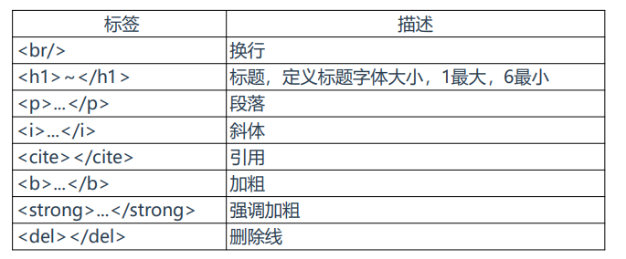
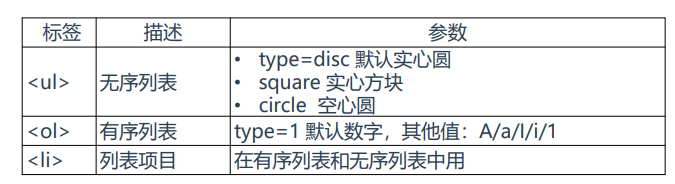
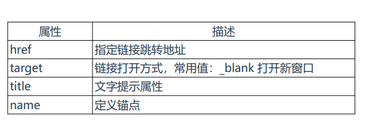
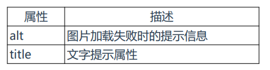
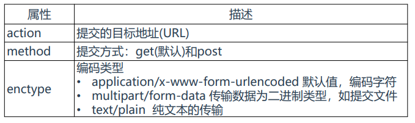
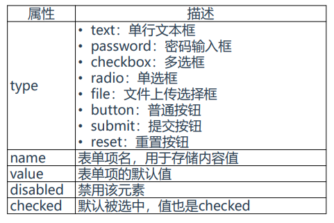
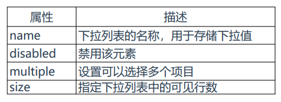
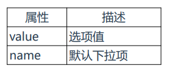

# web前端开发
## HTML

### 网页组成
```text
例如一个index.html页面：
• HTML标记语言：组成网页架构的元素组件
• CSS 样式语言：美化网页的样式
• JavaScript 程式语言：控制网页的动态效果
• JQuery 程式语言：协助及加强JavaScript的实现
```

```text
<!DOCTYPE html>
<html lang="en">
<head>
    <meta charset="UTF-8">
    <title>首页</title>
    <meta name=""Keywords content="关键字">
    <meta name="Description" content="简介、描述">
    <link rel="stylesheet" href="./css/main.css">
    <style>
        /* css代码 */
    </style>
    <script type="text/javascript">
        // js代码
    </script>
</head>
<body>
    <!-- 内容 -->
</body>
<style>
    /* css代码 */
</style>
<script type="text/javascript" src="./js/main.js"></script>
</html>
```
### HTML 标记语言
#### HTML介绍
HTML：是一种用于创建网页的标记语言, 可以使用HTML创建网页，用浏览器打开会自动解析。

HTML是由标签和内容构成。
```text
<html>
<head>
    <title>文档的标题</title>
</head>
<body>
    文档的内容...
</body>
</html>
```
#### 文本格式化标签


#### 列表标签


#### 超链接标签
```text
超链接标签：<a href="网址" ></a>
```



#### 图片标签
```text

```


#### 表格标签
```text
<table border="1">
    <thead>
        <tr>
            <th>主机名</th>
            <th>IP</th>
            <th>操作系统</th>
        </tr>
    </thead>
    <tbody>
        <tr>
            <td>www.xxxx.cn</td>
            <td>192.168.1.10</td>
            <td>CentOS7</td>
        </tr>
    </tbody>
</table>
```
```text
• table 表格标签
• thead 表格标题
• tr 行标签
• th 列名
• tbody 表格内容
• tr 列标签
• td 列内容
```

#### 表单标签

```text
表单标签：<form></form>
```


```text
表单项标签：<input>
```


```text
下拉列表标签：<select></select>
```


```text
下拉列表选项标签：<option> </option>
```


```text
按钮标签：<button type=“submit”></botton>

type可选值：
• button：普通
• submit：提交
• reset：重置

```

#### div标签

```text
<div>标签用于在HTML文档中定义一个区块。
<div>标签常用于将标签集中起来，然后用样式对它们进行统一排版。
```


## CSS

### CSS介绍
```text
CSS：是一种用于修饰网页的文本样式语言，还可以配合Javascript脚本语言动态对网页各元素操作。

格式： 选择器{属性:值;属性:值;属性:值;....}
选择器：需要改变样式的HTML元素
常见选择器：标签选择器、类选择器、ID选择器、派生选择器
```


### CSS使用方法
1、内联方式（行内样式）
```text
<p style="color:red">在HTML中如何使用css样式</p>
```
2、内部方式（内嵌样式），在head标签中使用
```text
<style type="text/css">
    p {
        color:red;
    }
</style>
```
3、外部导入方式（推荐），在head标签中使用
```text
<link href="main.css" type="text/css" rel="stylesheet"/>
```


### 选择器

#### 选择器：元素

元素选择器：使用html标签作为选择器，为指定标签设置样式。

示例1：h1元素设置样式
```text
h1 {
    color: red;
    font-size: 14;
}
```

示例2：多个元素设置样式
```text
h1,h2,h3,h4,h5,h6 {
    color: green;
}

```
示例3：子元素会继承最高级元素所有属性
```text
body {
    color: #000;
    font-family: Verdana, serif; /*字体*/
}
```
#### 选择器：ID
id选择器：使用“id”作为选择器，为指定id设置样式。

使用格式：#id名{样式...}

特点：
```text
• 每个标签都可以设置id
• 每个id名称只能在HTML文档中出现一次
• id名称不能以数字开头，不能是标签名称
• 在实际开发中，id一般预留JavaScript使用
```
第一步：给标签指定id
```text
<p id="t">...</p>
```
第二步：针对id设置样式
```text
#t {
color: red;
}

```

#### 选择器：类
类选择器：使用“类名”作为选择器，为指定id设置样式。

使用格式：.类名{样式...}

第一步：给标签指定类
```text
<p class="c">...</p>
```
第二步：针对类设置样式
```text
.c {
color: red;
}
```


#### 选择器：派生

### CSS常用属性


## JavaScript
## Jquery