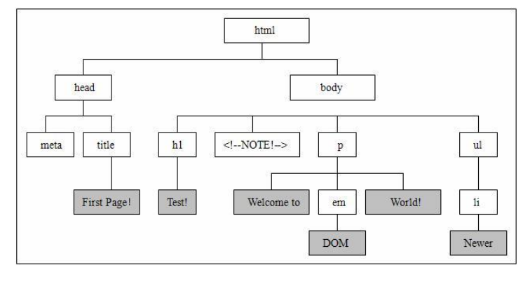

<!-- TOC -->
* [web前端开发](#web前端开发)
  * [HTML](#HTML)
    * [网页组成](#网页组成)
    * [HTML标记语言](#HTML标记语言)
      * [HTML介绍](#HTML介绍)
      * [文本格式化标签](#文本格式化标签)
      * [列表标签](#列表标签)
      * [超链接标签](#超链接标签)
      * [图片标签](#图片标签)
      * [表格标签](#表格标签)
      * [表单标签](#表单标签)
      * [div标签](#div标签)
  * [CSS](#CSS)
    * [CSS介绍](#CSS介绍)
    * [CSS使用方法](#CSS使用方法)
    * [选择器](#选择器)
      * [选择器元素](#选择器元素)
      * [选择器ID](#选择器ID)
      * [选择器类](#选择器类)
      * [选择器派生](#选择器派生)
    * [CSS常用属性](#CSS常用属性)
      * [内边距和外边距](#内边距和外边距)
      * [字体font](#字体font)
      * [文本](#文本)
      * [边框border](#边框border)
      * [背景background](#背景background)
      * [定位](#定位)
      * [浮动](#浮动)
      * [其他](#其他)
  * [JavaScript](#javascript)
      * [JavaScript介绍](#JavaScript介绍)
      * [JavaScript基本使用](#JavaScript基本使用)
      * [事件](#事件)
      * [通过选择器查找元素](#通过选择器查找元素)
      * [JS操作HTML](#JS操作HTML)
      * [数据类型](#数据类型)
        * [字符串](#字符串)
        * [数组](#数组)
        * [对象](#对象)
      * [操作符流程控制](#操作符流程控制)
        * [操作符](#操作符)
        * [条件判断](#条件判断)
        * [for循环](#for循环)
      * [函数](#函数)
        * [接收参数](#接收参数)
      * [Window对象](#Window对象)
        * [属性](#属性)
        * [方法](#方法)
  * [Jquery](#Jquery)
    * [jQuery介绍](#jQuery介绍)
    * [jQuery基本使用](#jQuery基本使用)
    * [选择器](#选择器)
    * [jQuery操作HTML](#jQuery操作HTML)
    * [jQueryAjax](#jQueryAjax)
<!-- TOC -->
# web前端开发
## HTML

### 网页组成
```text
例如一个index.html页面：
• HTML标记语言：组成网页架构的元素组件
• CSS 样式语言：美化网页的样式
• JavaScript 程式语言：控制网页的动态效果
• JQuery 程式语言：协助及加强JavaScript的实现
```

```text
<!DOCTYPE html>
<html lang="en">
<head>
    <meta charset="UTF-8">
    <title>首页</title>
    <meta name=""Keywords content="关键字">
    <meta name="Description" content="简介、描述">
    <link rel="stylesheet" href="./css/main.css">
    <style>
        /* css代码 */
    </style>
    <script type="text/javascript">
        // js代码
    </script>
</head>
<body>
    <!-- 内容 -->
</body>
<style>
    /* css代码 */
</style>
<script type="text/javascript" src="./js/main.js"></script>
</html>
```
### HTML标记语言
#### HTML介绍
HTML：是一种用于创建网页的标记语言, 可以使用HTML创建网页，用浏览器打开会自动解析。

HTML是由标签和内容构成。
```text
<html>
<head>
    <title>文档的标题</title>
</head>
<body>
    文档的内容...
</body>
</html>
```
#### 文本格式化标签


#### 列表标签


#### 超链接标签
```text
超链接标签：<a href="网址" ></a>
```


#### 图片标签
```text

```


#### 表格标签
```text
<table border="1">
    <thead>
        <tr>
            <th>主机名</th>
            <th>IP</th>
            <th>操作系统</th>
        </tr>
    </thead>
    <tbody>
        <tr>
            <td>www.xxxx.cn</td>
            <td>192.168.1.10</td>
            <td>CentOS7</td>
        </tr>
    </tbody>
</table>
```

```text
• table 表格标签
• thead 表格标题
• tr 行标签
• th 列名
• tbody 表格内容
• tr 列标签
• td 列内容
```

#### 表单标签

```text
表单标签：<form></form>
```


```text
表单项标签：<input>
```


```text
下拉列表标签：<select></select>
```


```text
下拉列表选项标签：<option> </option>
```


```text
按钮标签：<button type=“submit”></botton>

type可选值：
• button：普通
• submit：提交
• reset：重置

```

#### div标签

```text
<div>标签用于在HTML文档中定义一个区块。
<div>标签常用于将标签集中起来，然后用样式对它们进行统一排版。
```


## CSS

### CSS介绍
```text
CSS：是一种用于修饰网页的文本样式语言，还可以配合Javascript脚本语言动态对网页各元素操作。

格式： 选择器{属性:值;属性:值;属性:值;....}
选择器：需要改变样式的HTML元素
常见选择器：标签选择器、类选择器、ID选择器、派生选择器
```


### CSS使用方法
1、内联方式（行内样式）
```text
<p style="color:red">在HTML中如何使用css样式</p>
```
2、内部方式（内嵌样式），在head标签中使用
```text
<style type="text/css">
    p {
        color:red;
    }
</style>
```
3、外部导入方式（推荐），在head标签中使用
```text
<link href="main.css" type="text/css" rel="stylesheet"/>
```


### 选择器

#### 选择器元素

元素选择器：使用html标签作为选择器，为指定标签设置样式。

示例1：h1元素设置样式
```text
h1 {
    color: red;
    font-size: 14;
}
```

示例2：多个元素设置样式
```text
h1,h2,h3,h4,h5,h6 {
    color: green;
}

```
示例3：子元素会继承最高级元素所有属性
```text
body {
    color: #000;
    font-family: Verdana, serif; /*字体*/
}
```
#### 选择器ID
id选择器：使用“id”作为选择器，为指定id设置样式。

使用格式：#id名{样式...}

特点：
```text
• 每个标签都可以设置id
• 每个id名称只能在HTML文档中出现一次
• id名称不能以数字开头，不能是标签名称
• 在实际开发中，id一般预留JavaScript使用
```
第一步：给标签指定id
```text
<p id="t">...</p>
```
第二步：针对id设置样式
```text
#t {
color: red;
}

```

#### 选择器类
类选择器：使用“类名”作为选择器，为指定id设置样式。

使用格式：.类名{样式...}

第一步：给标签指定类
```text
<p class="c">...</p>
```
第二步：针对类设置样式
```text
.c {
color: red;
}
```

ID选择器与类选择器区别？
```text
1、id名称在一个HTML页面中不可以重复
2、class名称在一个html页面中可以重复，常用于一个样式对多个标签使用
3、id主要用于js选择，因为它是唯一
4、id以#开头，class是以.开头 
```


#### 选择器派生

派生选择器：依据元素在其位置的上下文关系来定义样式。



示例：
```text
<style type="text/css">
    .c p {
        color: red;
    }
</style>

<div class="c">
    <h1>一号标题</h1>
    <p>这是一个段落</p>
</div>
```


### CSS常用属性

#### 内边距和外边距
```text
padding（内边距）：钻戒到盒子内边框的距离
margin（外边距）：钻戒盒子距离桌子边缘的距离
border：钻戒盒子边框宽度
```
**内边距**

| 属性           | 描述             |
| -------------- | ---------------- |
| padding        | 设置四边的内边距 |
| padding-top    | 上内边距         |
| padding-right  | 右内边距         |
| padding-bottom | 下内边距         |
| padding-left   | 左内边距         |


**外边距**

| 属性          | 描述                                |
| ------------- | ----------------------------------- |
| margin        | 设置四边的外边距，使用方法同padding |
| margin-top    | 上外边距                            |
| margin-right  | 右外边距                            |
| margin-bottom | 下外边距                            |
| margin-left   | 左外边距                            |


**示例：**
```text
padding: 10px 5px 15px 20px # 上右下左
padding: 10px 5px 15px # 上右下
padding: 10px 5px # 上右
padding: 10px # 四边都是10px
```

#### 字体font

| 属性        | 描述                                                 | 值                                                           |
| ----------- | ---------------------------------------------------- | ------------------------------------------------------------ |
| font-size   | 设置字体的尺寸                                       | xx-small 、 x-small 、 small、 medium 、 large、 xlarge、xx-large，从小到大，默认值 medium<br />length 固定长度，例如12px |
| font-family | 字体系列。可以写多个， 如果第一个不支持，使 用下一个 | Microsoft YaHei                                              |
| font-weight | 设置字体的粗细                                       | • normal 默认值 <br />• bold 粗体 <br />• bolder 更粗<br /> • lighter 更细 |
| font-style  | 字体样式                                             | • normal 正常 <br />• italic 斜体 <br />• oblique 倾斜的字体 |

#### 文本
| 属性            | 描述               | 值                                                           |
| --------------- | ------------------ | ------------------------------------------------------------ |
| text-align      | 文本对齐方式       | • left左边 <br />• right 右边<br /> • center 中间 <br />• justify 两端对齐文本效果 |
| text-decoration | 文本修饰           | • none 默认，定义标准的文本，例如去掉超链接下划线 <br />• line-through 删除线 <br />• underline 文本下加一条线 |
| text-overflow   | 文本溢出后显示效果 | • clip 修剪文本 <br />• ellipsis 显示省略号来代表被修剪的文本 <br />• string 使用给定的字符串来代表被修剪的文本 |
| letter-spacing  | 字符间的距离       | • normal 默认 <br />• length 自定义间距                      |
| line-height     | 行间的距离（行高） | • normal 默认<br /> • length 设置固定值                      |
| color           | 字体颜色           | • 颜色名称，例如red<br /> • 十六进制值，例如#ff0000 <br />• rgb 代码，例如rgb(255,0,0) |

#### 边框border
| 属性                                                         | 描述                                       | 值                                                           |
| ------------------------------------------------------------ | ------------------------------------------ | ------------------------------------------------------------ |
| border                                                       | 所有边框样式的缩写                         | 示例：border: 1px solid blue; 宽度 样式 颜色                 |
| border-color                                                 | 边框样式                                   | • solid 实线边框<br /> • dotted 点线 <br />• dashed 虚线<br /> • none 不显示边框，默认 |
| border-radius                                                | 圆角边框                                   | 直接写像素                                                   |
| border-left<br />border-right<br />border-top<br />border-bottom | 左边框<br />右边框<br />上边框<br />下边框 | 例如设置底边框为虚线：<br /> border-bottom: 1px dotted red;  |
| box-shadow                                                   | 给元素添加阴影                             | 格式：box-shadow: h-shadow v-shadow blur spread color inset;<br /> • h-shadow 必选，水平阴影的位置 <br />• v-shadow 必选，垂直阴影的位置 <br />• blur 可选，模糊程度 <br />• spread 可选，阴影的大小 <br />• color 可选，阴影的颜色 <br />• inset 可选，从外层的阴影（开始时）改变阴影内侧阴影 <br />示例1：box-shadow: 1px 2px 3px 1px #c2c2c2;<br /> 示例2：box-shadow: 0 5px 20px 0 #e8e8e8; |

#### 背景background
| 属性                | 描述                       | 值                                                           |
| ------------------- | -------------------------- | ------------------------------------------------------------ |
| background-color    | 背景颜色                   | • 颜色名称，例如red <br />• 十六进制值，例如#ff0000 <br />• rgb 代码，例如rgb(255,0,0) |
| background-image    | 背景图片                   | • url('URL') 图片路径 <br />• none 不显示背景图片            |
| background-repeat   | 设置是否及如何重复背景图像 | • repeat 默认。背景图像将在垂直方向和水平方 向重复<br /> • repeat-x 背景图像将在水平方向重复 <br />• repeat-y 背景图像将在垂直方向重复 <br />• no-repeat 背景图像将仅显示一次 |
| background-position | 背景图片的位置             | • left、top、top right、center left、center center、center right、bottom left、 bottom center、bottom right<br /> • x% y% 水平位置和垂直位置 |
| background-size     | 背景图片的尺寸             | • length 背景的高度和宽度，例如80px 60px<br /> • percentage 以父元素的百分比设置背景图像 的高度和宽度，例如50% 50% |

#### 定位
position属性：把你元素定到什么位置，或者把你元素根据什么定位。

| 值       | 描述                                                         |
| -------- | ------------------------------------------------------------ |
| absolute | 绝对定位，根据自己最近的一个父元素定位，而且父元素必须相对定位 过。如果没父元素，根据窗口定位。 |
| fixed    | 固定定位，是根据浏览器窗口进行定位。                         |
| relative | 相对定位，相对于自己定位，偏移后，元素仍保持其未定位前的形状。 原来的空间依然保留，只是看不到了。 |
| static   | 默认值。没有定位，元素框正常生成，出现在正常的流中。         |


````text
使用步骤：
1. 先使用postion告诉怎么定位
2. 再告诉它定位到哪

• left 靠左距离
• right 靠右距离
• top 顶部距离
• bottom 底部距离

````
示例1：登录页面，div在页面中间
```text
.div {
  width: 200px;
  height: 200px;
  border: 1px dashed blue;
  position: absolute;
  top: 0;
  left: 0;
  bottom: 0;
  right: 0;
  margin: auto;
}

```

示例2：回到顶部，div在右下角
```text
.go {
  position: fixed;
  right: 20px;
  bottom: 30px;
}

<a href="#" class="go">回到顶部</a>
```
#### 浮动
float属性：定义元素在哪个方向浮动。
可选值：none、left、right

```text
特点：
  • 只能水平浮动，不能横向浮动
  • 浮动碰到父元素的边框或者浮动元素的边框就会停止
  • 浮动元素的后一个元素会围绕着浮动元素（典型应用：文字围绕图片）
  • 浮动元素的前一个元素不会受到任何影响（如果想让两个块元素并排显示，必须让两个块元素都应用float）
```
#### 其他

| 属性            | 描述           | 描述                                                         |
| --------------- | -------------- | ------------------------------------------------------------ |
| list-style-type | 列表样式       | none 不显示项目符号                                          |
| overflow        | 内容溢出处理   | • hidden 溢出部分隐藏 <br />• scroll 不管是否溢出都显示滚动 <br />• auto 溢出显示滚动条，不溢出没有滚动条 |
| display         | 是否及如何显示 | • none 隐藏该元素<br /> • block 显示为块级元素 <br />• inline 默认 |


## JavaScript

#### JavaScript介绍
```text
JavaScript（简称JS）：是一种轻量级客户端脚本语言，通常被直接嵌入HTML 页面，在浏览器上执行。

JavaScript作用：改变页面中的HTML元素、属性、样式、事件。
```

#### JavaScript基本使用

```text
1、内部方式（内嵌样式），在body标签中使用

<script type="text/javascript">
  <!--
  javaScript语言
  -->
</script>

2、外部导入方式（推荐），在head标签中使用
<script type="text/javascript" src="my.js"></script>

示例：
<script>
  var name = "hello"; // 定义变量
  alert(name); // 警告框方法，浏览器提示消息
  /* alert(“你好”) */ // 单行与多行注释
</script>

```

#### 事件

事件：指的是当HTML中发生某些事件时所调用的方法（处理程序）。

例如点击按钮，点击后做相应操作，例如弹出一句话

#### 通过选择器查找元素

```text
想操作元素，必须先找到元素，主要通过以下三种方法：
  • 通过id（常用）
  • 通过类名
  • 通过标签名
```

示例：通过id查找元素
```text
<button type="button" id="btn">点我</button>
<script>
  var x = document.getElementById(“btn”); //获取id为btn的元素
  x.onclick = function () { //绑定点击事件
    alert('亲，有什么可以帮助你的？')
  };
</script>

```

示例：通过标签名
```text
<div id="main">
  <p>Hello world！1</p>
  <p>Hello world！2</p>
  <p>Hello world！3</p>
</div>
<script type="text/javascript">
  var x = document.getElementById(“main”); //获取id为main的元素
  var y = x.getElementsByTagName("p"); // 返回的是一个集合，下标获取
  document.write(“div中的第二段文本是：” + y[1].innerHTML); //向当前文档写入
内容
</script>
```

#### JS操作HTML

```text
插入内容：
document.write(“<p>这是JS写入的段落</p>”); //向文档写入HTML内容
x = document.getElementById(‘demo’); //获取id为demo的元素
x.innerHTML=“Hello” //向元素插入HTML内容

改变标签属性：
document.getElementById(“image”).src=“b.jpg“ //修改img标签src属性值

改变标签样式：
x = document.getElementById(“p”) //获取id为p的元素
x.style.color=“blue” //字体颜色

获取输入的值：
var x = document.getElementById(“input”); //获取id为input的元素
var y = document.getElementById(“p”) //获取id为p的元素
y.innerHTML = x.value //设置y元素的内容是input的值

添加元素：
var p = document.createElement("p"); //创建p标签
var t = document.createTextNode("这是第三个段落。"); //创建添加的文本
p.appendChild(t); //向创建的p标签追加文本
var e = document.getElementById("main"); //获取添加的标签父元素
e.appendChild(p) //向父元素添加新创建的p标签

删除元素：
var p = document.getElementById(“main”)
p.remove(); //删除元素

```


#### 数据类型
##### 字符串
```text
在JS中，数据类型有：字符串、数字、布尔、数组、对象、Null、Undefined
字符串处理：
var s = "hello world";
s.length; // 字符串长度
s[4] //根据索引获取值
s.replace('h','H'); //替换某个字符
s.split("分隔符") //分隔为数组
s.match("w") //找到返回匹配的字符，否则返回null

字符串拼接：“+”
```


##### 数组
```text
数组：是一个序列的数据结构。

定义：
var computer = new Array();
或
var computer = ["主机","显示器","键盘","鼠标"]

向数组添加元素：
computer[0]="主机";
computer[1]="显示器";
computer[2]="键盘";
或
array.push("鼠标")
通过索引获取元素：
computer[2]

```

##### 对象
```text
对象：是一个具有映射关系的数据结构。用于存储有一定关系的元素。
格式：d = {'key1':value1, 'key2':value2, 'key3':value3}
注意：对象通过key来访问value，因此字典中的key不允许重复。
定义：
var user = {
  name:"张三",
  sex: "男",
  age:"30"
};
通过键查询值：
n = user.name;
或
sex = user['sex'];
增加或修改：
user.height = "180cm"
user['height'] = "180cm"
```

#### 操作符流程控制
操作符：一个特定的符号，用它与其他数据 类型连接起来组成一个表达式。
常用于条件判断，根据表达式返回True/False采取动作。


##### 操作符


| 类型       | 操作符                                                       |
| ---------- | ------------------------------------------------------------ |
| 比较操作符 | • == 等于<br /> • != 不等于<br /> • > 大于<br /> • < 小于 <br />• >= 大于等于 <br />• <= 小于等于 |
| 算术操作符 | • + 加法 <br />• - 减法 <br />• * 乘法 <br />• / 除法 <br />• % 取余 <br />• ++ 自增，自动+1 <br />• -- 自减，自动-1 |
| 逻辑操作符 | • && 与 <br />• \|\| 或 <br />• !() 结果取反                 |
| 赋值运算符 | • = 赋值 <br />• += 加法赋值 <br />• -= 减法赋值 <br />• *= 乘法赋值 <br />• /= 除法赋值 <br />• %= 取余赋值 |

##### 条件判断
**if条件判断**：判定给定的条件是否满足（True或False），根据判断的结果决定执行的语句。

语法：
```text
if (表达式) {
  <代码块>
} else if (表达式) {
  <代码块>
} else {
  <代码块>
}
```

示例：根据用户点击做不同操作

```text

<button type="button" onclick="changeImage('on')">开灯</button>
<button type="button" onclick="changeImage('off')">关灯</button>

<script type="text/javascript">
  function changeImage(status) {
      x = document.getElementById('myimage');
      if (status == 'on') {
        x.src = "img/on.jpg";
      } else if (status == 'off') {
        x.src = "img/off.jpg";
      }
  }
</script>
```

##### for循环

**for循环**：一般用于遍历数据类型的元素进行处理，例如字符串、数组、对象。
语法：
```text
for (<变量> in <序列>) {
  <代码块>
}
```
示例：遍历数组
```text
var computer = ["主机","显示器","键盘","鼠标"];
方式1：
for(i in computer) {
  console.log(computer[i]) // 使用索引获取值
}
方式2：
computer.forEach(function (e) {
  console.log(e)
})

```
示例：遍历对象
```text
var user = {name:"zhangsan",sex:"男",age:"30"};
方式1：
for(let k in user) {
  console.log(k + ":" + user[k])
}
方式2：
Object.keys(user).forEach(function (k) {
  console.log(k + ":" + user[k])
})
```

**continue与break语句**

• continue 当满足条件时，跳出本次循环

• break 当满足条件时，跳出所有循环

注：只有在循环语句中才有效。

示例：
```text
var computer = ["主机","显示器","键盘","鼠标"];
//不打印第三个元素
for(i in computer) {
  if (i == "2") {
    continue
  } else {
    console.log(computer[i])
  }
}
//不打印第第二个以后的元素
for(i in computer) {
  if (i == "2") {
    break
  } else {
    console.log(computer[i])
  }
}
```


#### 函数

函数：是指一段可以直接被另一段程序或代码引用的程序或代码。

在编写代码时，常将一些常用的功能模块编写成函数，放在函数库中供公共使用，可减少重复编写程序段和简化代码结构。

```text
语法：
function 函数名称(参数1, 参数2, ...) {
  <代码块>
  return <表达式>
}
示例：
<button type="button" id="btn" onclick="hello()">你好</button>
function hello() {
  alert("hello world")
}
```
##### 接收参数
示例：
```text
<button type="button" onclick="myFunc('阿良', '30')">点我</button>
<script type="text/javascript">
  function myFunc(name, age) {
    alert("欢迎" + name + ", 今年" + age);
  }
</script>
```

#### Window对象

##### 属性
Window 对象表示浏览器中打开的窗口。

| window对象属性 | 描述                                               |
| -------------- | -------------------------------------------------- |
| document       | 每个载入浏览器的 HTML 文档都会成为 Document 对象   |
| innerheight    | 返回窗口的文档显示区的高度                         |
| innerwidth     | 返回窗口的文档显示区的宽度                         |
| location       | Location 对象包含有关当前 URL 的信息               |
| Navigator      | Navigator 对象包含有关浏览器的信息                 |
| Screen         | Screen 对象包含有关客户端显示屏幕的信息            |
| history        | History 对象包含用户（在浏览器窗口中）访问过的 URL |
| window         | window 包含对窗口自身的引用                        |

示例：刷新按钮
```text
<button type="button" onclick="location.reload()">刷新当前页面</button>
<button type="button" onclick="location.href=location.href">重新请求当前页面</button>
<button type="button" onclick="location.href='http://www.baidu.com'">请求别的页面</button>
```

##### 方法

| window对象方法  | 描述                                                 |
| --------------- | ---------------------------------------------------- |
| alert()         | 显示带有一段消息和一个确认按钮的警告框               |
| confirm()       | 显示带有一段消息以及确认按钮和取消按钮的对话框       |
| setInterval()   | 按照指定的周期（以毫秒计）来调用函数或计算表达式     |
| clearInterval() | 取消由 setInterval() 设置的 timeout                  |
| setTimeout()    | 在指定的毫秒数后调用函数或计算表达式。（类似于休眠） |
| clearTimeout()  | 取消由 setTimeout() 方法设置的 timeout               |
| typeof()        | 查看数据类型                                         |

示例：定时刷新页面数据

```text
<div id="demo">
    <p>这是动态数据。</p>
</div>
<button type="button" onclick="startRefresh()">开始刷新</button>
<button type="button" onclick="stopRefresh()">停止刷新</button>
<script type="text/javascript">
    // 定时要做的事
    function refresh() {
      x = document.getElementById("demo");
      y = x.getElementsByTagName("p");
      y[0].innerHTML = new Date();
}
  // 启动定时
function startRefresh() {
    interval = setInterval("refresh()", 2000);
}
// 取消定时
function stopRefresh() {
    clearInterval(interval);
}
</script>
```

## Jquery

### jQuery介绍
jQuery 是一个 JavaScript 库。极大地简化了 JavaScript 编程，例如JS原生代码几十行实现的功能，jQuery可能一两行就可以实现，因此得到前端程序猿广泛应用。

官方网站： https://jquery.com

发展至今，主要有三个大版本：

• 1.x：常用版本

• 2.x，3.x：除非特殊要求，一般用的少


### jQuery基本使用


下载地址：

https://cdn.bootcdn.net/ajax/libs/jquery/1.12.4/jquery.min.js

https://cdn.bootcdn.net/ajax/libs/jquery/2.2.4/jquery.min.js

https://cdn.bootcdn.net/ajax/libs/jquery/3.5.1/jquery.min.js

jQuery代码编写位置与JS位置一样，但需要先head标签里引入jquery.min.js文件
```text
<head>
    <script type="text/javascript" src="https://cdn.bootcdn.net/ajax/libs/jquery/1.12.4/jquery.min.js"></script>
</head>
<body>
<script type="text/javascript">
    // jquery代码
</script>
</body>
```
**JQuery语法：**
```text
<button type="button" id="btn">点我</button>
<script type="text/javascript">
    $("#btn").click(function () {
        alert('亲，有什么可以帮助你的？')
  })
</script>
```

**基础语法是：$(selector).action()**

```text
• $：代表jQuery本身
• (selector)：选择器，查找HTML元素
• action()：对元素的操作
```

**JS语法:**
```text
<button type="button" id="btn">点我</button>
<script type="text/javascript">
  var x = document.getElementById("btn")
  x.onclick = function () {
    alert('亲，有什么可以帮助你的？')
    }
</script>
```


### 选择器


| 名称       | 语法                    | 示例                                                         |
| ---------- | ----------------------- | ------------------------------------------------------------ |
| 标签选择器 | element                 | $(“h2”) 选取所有h2元素                                       |
| 类选择器   | .class                  | $(“.title“) 选取所有class为title的元素                       |
| ID选择器   | \#id                    | $(“#title”) 选取id为title的元素                              |
| 并集选择器 | selector1,selector2,... | $(“div,p,.title”) 选取所有div、p和拥有class为title的元素     |
| 属性选择器 |                         | $(“input[name]=‘username’”) 选取input标签名为username的元素 <br />$(“[href=‘#’]”) 选取href值等于“#”的元素 |


### jQuery操作HTML

**隐藏和显示元素：**
```text

• hide() ：隐藏某个元素
• show() ：显示某个元素
• toggle() ：hide()和show()方法之间切换
```
示例：
```text
<p id="demo">这是一个段落。</p>
<button id="hide" type="button">隐藏</button>
<button id="show" type="button">显示</button>
<button id="toggle" type="button">切换</button>
<script type="text/javascript">
  $("#hide").click(function () {
    $("p").hide();
  });
  $("#show").click(function () {
      $("p").show();
  });
  $("#toggle").click(function () {
    $("p").toggle();
  })
</script>
```
**获取与设置内容**

• text() 设置或返回所选元素的文本内容

• html() 设置或返回所选元素的HTML内容

• val() 设置或返回表单字段的值

示例：
```text
<p id="txt">这是一个<b>段落</b>。</p>
<button type="button" id="btn1">显示文本</button>
<button type="button" id="btn2">显示HTML</button>
<p id="demo"></p>

<script type="text/javascript">
  $("#btn1").click(function () {
    x = $("#txt").text();
    $("#demo").text(x).css("color","red") //不会解析b标签
  });
  $("#btn2").click(function () {
    x = $(“#txt”).html(); //获取
    $(“#demo”).html(x).css("color","red") //会解析b标签，.html()设置
  })
</script>

```
示例：
```text
<h1>欢迎访问运维管理系统</h1>
用户名：<input type="text" id="uname" name="username"><br>
密码：<input type="text" id="pwd" name="password"><br>
<button type="button" id="btn">显示输入内容</button>
<p id="demo"></p>

<script type="text/javascript">
  $("#btn").click(function () {
    x = $("#uname").val();
    y = $("#pwd").val();
    $(“#demo”).text(x + ‘，’ + y).css("color","red")
  })
</script>
```
**获取、设置和删除属性：**

• attr() 设置或返回所选元素的属性值

• removeAttr() 删除属性值


示例：
```text
<a href="http://www.aliangedu.cn" id="a1">学院官网</a><br>
<button type="button" id="btn">查看CSS属性值</button>
<p id="demo"></p>
<script type="text/javascript">
  $("#btn").click(function () {
    x = $(“#a1”).attr(“href”); //获取属性值
    $(“#demo”).text(x) //将属性值作为内容设置元素
  })
</script>
```
设置超链接值：

```text
<script type="text/javascript">
  $("#btn").click(function () {
    $("#a1").attr("href", "http://www.baidu.com");
  })
</script>

```
删除超链接属性：
```text
<script type="text/javascript">
  $("#btn").click(function () {
    x = $("#a1").removeAttr("href");
  })
</script>
```
**添加元素：**
```text
• append() 在被选中元素的结尾插入内容
• prepend() 在被选中元素的开头插入内容
• after() 在被选中元素之后插入内容
• before() 在被选中元素之前插入内容
```
示例：
````text
<p>这是一个段落。</p>
<button id="btn1">追加文本</button>
<script type="text/javascript">
  $("#btn1").click(function () {
    $("p").append("这是追加的内容。");
  });
</script>
````

**删除元素：**
```text
• remove() 删除被选元素及子元素
• empty() 清空被选元素（删除下面所有子元素）
```
示例：
```text
<div style='height: 50px;width: 50px;background-color: red' id="demo">
</div>
<button id="btn">删除DIV</button>
<script type="text/javascript">
    $("#btn").click(function () {
    $("#demo").remove();
  })
</script>
```
**设置CSS样式：**

• css() 设置或返回样式属性（键值）

• addClass() 向被选元素添加一个或多个类样式

• removeClass() 从被选元素中删除一个或多个类样式

• toggleClass() 对被选元素进行添加/删除类样式的切换操作


示例：
```text
<div style='height: 50px;width: 50px;background-color: red' id="demo"></div>

<button id="btn">删除DIV</button>
<script type="text/javascript">
  $("#btn").click(function () {
    $("#demo").remove();
  })
</script>
```

### jQueryAjax
浏览器访问网站一个页面时，Web服务器处理完后会以消息体方式返回浏览器，浏览器自动解析HTML内容。

如果局部有新数据需要更新，需要刷新浏览器重新发起页面请求获取最新数据，如果每次都是通过刷新解决这个问题，势必会给服务器造成负载加重，页面加载缓慢。

Ajax（Asynchronous JavaScript And XML，异步JavaScript和XML），AJAX 是一种在无需重新加载整个网页的情况下，能够更新部分网页的技术。例如在不刷新页面的情况下查询数据、登录验证等


**无刷新的好处：**

• 减少带宽、服务器负载

• 提高用户体验

**jQuery Ajax主要使用$.ajax()方法实现，用于向服务端发送HTTP请求。**

```text
语法：$.ajax([settings]);
```

settings 是$.ajax ( )方法的参数列表，用于配置 Ajax 请求的键值对集合，参数如下：


| 参数        | 类型                  | 描述                                                         |
| ----------- | --------------------- | ------------------------------------------------------------ |
| url         | string                | 发送请求的地址，默认为当前页地址                             |
| type        | string                | 请求方式，默认为GET                                          |
| data        | obejct、array、string | 发送到服务器的数据                                           |
| dataType    | string                | 预期服务器返回的数据类型，包括JSON、XML、text、HT            |
| contentType | string                | 发送信息至服务器时内容编码类型。默认值: "application/xwww-form-urlencoded"。 |
| timeout     | number                | 设置请求超时时间                                             |
| global      | Boolean               | 表示是否触发全局Ajax事件，默认为true                         |
| headers     | obejct                | 设置请求头信息                                               |
| async       | Boolean               | 默认true，所有请求均为异步请求。设置false发送同步请求        |


Ajax使用示例
````text
$.ajax({
  type: "POST",
  url: "/ajax_api",
  data: data,
  success: function (result) { // result是返回的json数据
    if(result.code == '0') {
        // 服务器数据处理成功
    } else if(result.code == '1') {
        // 服务器数据处理失败
    }
  },
  error: function () {
    // 访问不了接口或者data数据格式不对
  }
})

````

回调函数：参数引用一个函数，并将数据作为参数传递给该函数。

jqXHR：一个XMLHttpRequest对象

| 参数       | 函数格式                                      | 描述                                                      |
| ---------- | --------------------------------------------- | --------------------------------------------------------- |
| beforeSend | function(jqXHR,object)                        | 发送请求前调用的函数，例如添加自定义 HTTP头               |
| success    | function(data, String textStatus,jqXHR)       | 请求成功后调用的函数，参数data：可选， 由服务器返回的数据 |
| error      | function(jqXHR,String textStatus,errorThrown) | 请求失败时调用的函数                                      |
| complete   | function(jqXHR, String textStatus)            | 请求完成后（无论成功还是失败）调用的 函数                 |

HTTP方法：向服务器提交数据，服务器根据对应方法操作

常见的HTTP方法：


| HTTP方法 | 数据处理 | 说明         |
| -------- | -------- | ------------ |
| POST     | 新增     | 新增一个资源 |
| GET      | 获取     | 取得一个资源 |
| PUT      | 更新     | 更新一个资源 |
| DELETE   | 删除     | 删除一个资源 |


示例
```text
<!DOCTYPE html>
<html lang="en">
<head>
    <meta charset="UTF-8">
    <title>新增服务器</title>
  <script type="text/javascript" src="https://cdn.bootcdn.net/ajax/libs/jquery/1.12.4/jquery.min.js"></script>
</head>
<body>
<h1>添加服务器信息</h1>
<form action="#" method="post">
  主机名：<input type="text" name="hostname"><br>
  IP地址：<input type="text" name="ip"><br>
  操作系统：<input type="text" name="os"><br>
  <button type="button" id="btn">提交</button>
</form>

<script>
  $("#btn").click(function () {
    // 先获取表单中的值
    var hostname = $("input[name='hostname']").val();
    var ip = $("input[name='ip']").val();
    var os = $("input[name='os']").val();
    console.log(hostname, ip, os)
    // 将表单的值统一放到对象
    data = {'hostname': hostname, 'ip': ip, 'os': os}
    // 通过Ajax将这个对象提交到服务端接口
    $.ajax({
      type: "POST",
      url: "/server/",
      data: data,
      success: function (result) {
        if(result.code == 0) {
          console.log(result)
        } else if(result.code == 1){
          console.log(result.msg)
        }
      },
      error: function(){
        alert("服务器异常！")
      }
    })
  });
</script>

</body>
</html>
```


